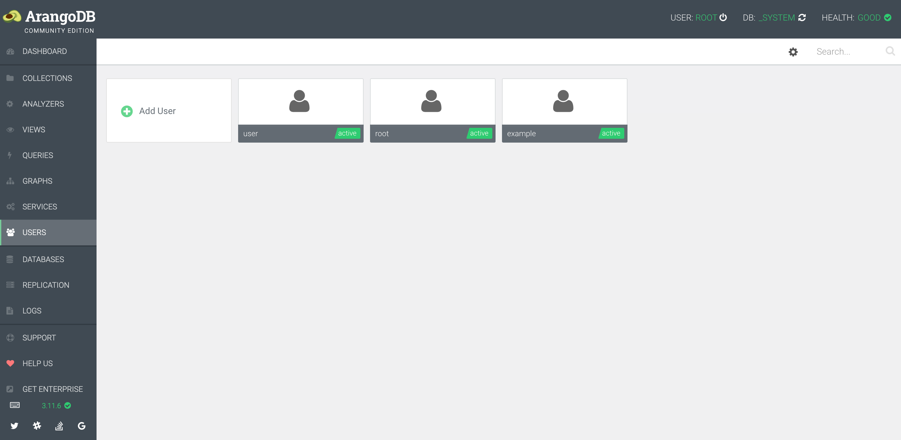
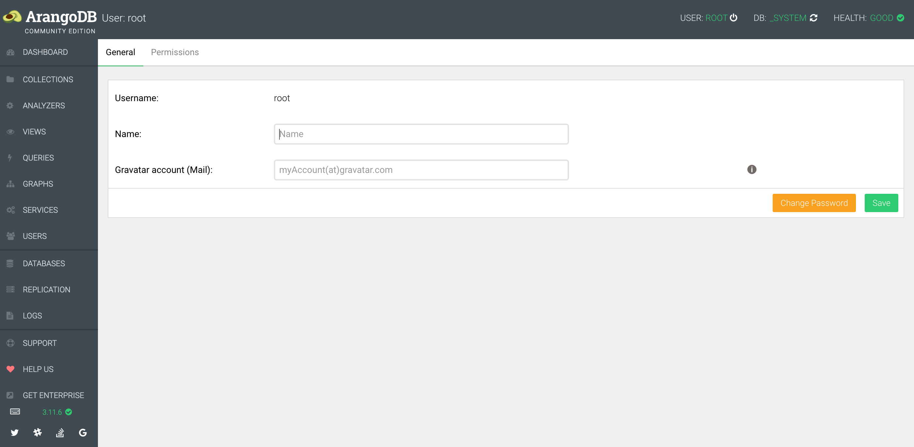
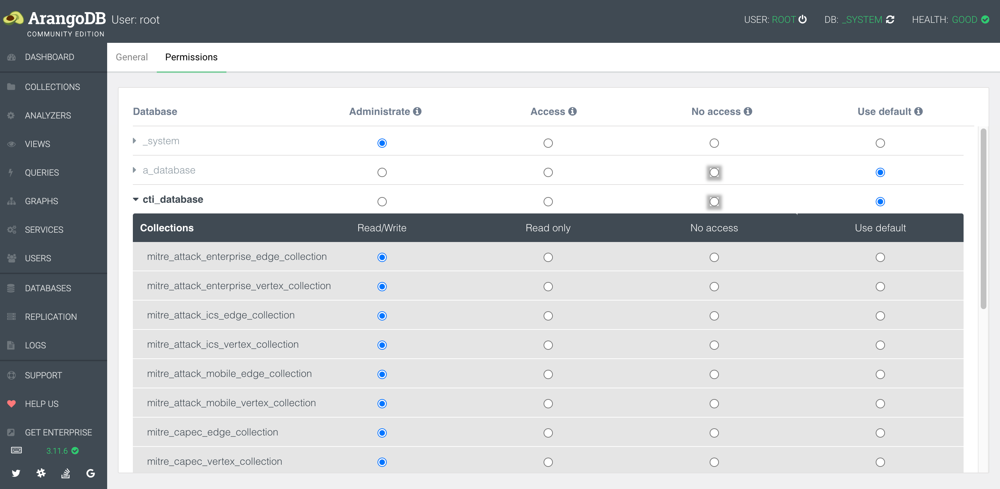

# Arango TAXII Server

## Overview

Arango TAXII Server is a production ready implementation of a TAXII 2.1 Server designed to work with ArangoDB.

## tl;dr

[](https://www.youtube.com/watch?v=tYWOy-S457s)

## Install

### Download and configure

```shell
# clone the latest code
git clone https://github.com/muchdogesec/arango_taxii_server
cd arango_taxii_server
# fetch submodules
git submodule update --init --recursive
```

### Setup configoration options

You will need to create an `.env` file as follows;

```shell
cp .env.example .env
```

You will then need to specify details of your ArangoDB server.

You can also set the TAXII Server information in this file.

#### ArangoDB install

Note, this script will not install an ArangoDB instance.

If you're new to ArangoDB, [you can install the community edition quickly by following the instructions here](https://arangodb.com/community-server/).

If you are running ArangoDB locally, be sure to set `ARANGODB='http://host.docker.internal:8529/'` in the `.env` file otherwise you will run into networking errors.

### Build the Docker Image

```shell
sudo docker-compose build
```

### Start the server

```shell
sudo docker-compose up
```

### Access the server

The webserver (Django) should now be running on: http://127.0.0.1:8000/

You can access the Swagger UI for the API in a browser at: http://127.0.0.1:8000/api/schema/swagger-ui/

#### Exporting the schema

You can use the `/schema` endpoint to export the OpenAPI schema for the API and import it into other tools.

For example to use the API with Postman

1. http://127.0.0.1:8000/api/schema/?format=yaml
2. import the txt file to postman, by selecting; collections > import > upload txt file downloaded at step 1

#### Note on Django

The webserver is Django.

To create an admin user in Django

```shell
sudo docker-compose run django python manage.py createsuperuser
```

There is currently no Django admin UI.

### Running in production

Note, if you intend on using this in production, you should also modify the variables in the `.env` file for `POSTGRES_DB`, `POSTGRES_USER`, `POSTGRES_PASS`, `DJANGO_SECRET` and `DEBUG` (to `False`)

### Adding data to the server

It is STRONGLY recommend you seed your ArangoDB database using [stix2arango](https://github.com/muchdogesec/stix2arango). If not, that is OK, but it is imperative you create Databases and Collection as follows;

* All databases should be suffixed with `_database`, e.g (`my_taxii_database`)
* All edge collections should be suffixed with `_edge_collection` (e.g. `my_taxii_edge_collection`)
* All vertex collections should be suffixed with `_vertex_collection` (e.g. `my_taxii_vertex_collection`)

In the stix2arango README.md you will find some quick start guides that will import some common knowledgebase data into Arango which is very useful in demonstrating how your Databases and Collections should be structured to work with Arango TAXII Server.

## Important design decisions

The following information should hopefully help you to determine if this TAXII implementation is right for you.

### STIX / TAXII versions

* this server is only designed to serve/accept STIX 2.1 objects
* this server is built to the TAXII 2.1 specification
	* All TAXII 2.1 endpoints are implemented as per the specification here (dated 10 June 2021): https://docs.oasis-open.org/cti/taxii/v2.1/taxii-v2.1.html

### Databases

This code is only designed to work with ArangoDB. That includes all versions of ArangoDB, including the free community edition.

### Users / Authentication / Permissions

Authentication is managed by ArangoDB.



Under the `_system` database, admin users can add or remove other users from the system.



Each user has a username and password.

These values are used to authenticate against the API, using basic auth in the header of each request;

```
Authorization: Basic <credentials>
```

Users can also be assigned permissions on a database and Collection level.



A user can be assigned read/write or read permissions to a Collection.

* Users with no permissions cannot see the database or collection.
* Users with read can view objects in the collection
* Users with read/write can view objects in the collection as well as add and delete objects in the collection.

### ArangoDB -> TAXII mapping

ArangoDB has the following structure

```txt
├── database
│   ├── document collection
│   ├── document collection N
│   ├── edge collection
│   └── edge collection N
├── database N
│   ├── document collection
│   ├── document collection N
│   ├── edge collection
│   └── edge collection N
├── ...
```

An ArangoDB database has the following attributes;

* `name` (required)
* `identifier` (autogenerated)

An ArangoDB collection has the following attributes;

* `name` (required)
* `type` (required): either document or edge
* `identifier` (autogenerated)

TAXII has the following structure

```txt

├── api-root
│	├── collection
│   │	└── stix objects
│   └── collection
│   	└── stix objects
├── api-root
│	├── collection
│   │	└── stix objects
│   └── collection
│   	└── stix objects
├── ...
```

A TAXII root has the following attributes;

* `title` (required)
* `description` (optional)
* `versions` (required)
* `max_content_length` (required)

A TAXII collection has the following attributes:

* `id` (required)
* `title` (required)
* `description` (optional)
* `alias` (optional)
* `can_read` (required)
* `can_write` (required)
* `media_types` (optional)

In Arango TAXII Server; ArangoDB Databases map to TAXII API Roots as follow...

TAXII attribute -> ArangoDB attribute

* `taxii.api-root.title` -> `arango.database.name`
* `taxii.api-root.versions` -> not inherited from arango (always `application/taxii+json;version=2.1` as this is what Arango TAXII Server supports)
* `taxii.api-root.max_content_length` -> not inherited from arango (set in the conf file but determined at the webserver level based on maximum size it can support for responses, thus will be the same value for all API Roots)

In Arango TAXII server; ArangoDB Collections map to TAXII Collections as follow...

TAXII attribute -> ArangoDB attribute

* `taxii.collection.id` -> `arango.collection.identifier`
* `taxii.collection.title` -> `arango.collection.name (without type -- see stix2arango coupling)`
* `taxii.collection.alias` -> `arango.collection.name (without type -- see stix2arango coupling)`
* `taxii.collection.can_read` -> not inherited from arango (this is dynamic, is boolean depending if authorised user can read collection. In reality should always be `TRUE` as users should not be shown any collections they cannot read)
* `taxii.collection.can_write` -> not inherited from arango (this is dynamic, is boolean depending if authorised user can write to collection)
* `taxii.collection.media_types` -> not inherited from arango (always `application/stix+json;version=2.1` because we only ever store STIX 2.1 objects)

### stix2arango coupling

Arango TAXII Server uses [stix2arango](https://github.com/muchdogesec/stix2arango) as a middleware component when creating objects (Add Object endpoint).

The two important things to be aware of about this coupling is that

1. Arango TAXII Server expects 2 collections with the same name, one with the edge suffix and one with the vertex suffix (e.g. `my_taxii_edge_collection` and `my_taxii_vertex_collection`) to store objects correctly.
2. For any request these ArangoDB Collections exposed to the user as a single TAXII collection called `my_taxii`, but under the hood both Collections are used.

## Useful supporting tools

* [TAXII 2.1 Specification](https://docs.oasis-open.org/cti/taxii/v2.1/taxii-v2.1.html)
* [STIX 2.1 Specification](https://docs.oasis-open.org/cti/stix/v2.1/stix-v2.1.html)

## Other TAXII server implementations

We realise not everyone will want to use ArangoDB. Here are some other open-source TAXII server options you could consider;

* OASIS TC Open Repository: TAXII 2 Server Library Written in Python: https://github.com/oasis-open/cti-taxii-server
* A cyber threat intelligence server based on TAXII 2 and written in Golang: https://github.com/freetaxii/server
* TAXII server implementation in Python from EclecticIQ: https://github.com/eclecticiq/OpenTAXII

## Support

If you are a paying DOGESEC customer, please contact our support team.

For everyone else, [minimal support provided via the DOGESEC community](https://community.dogesec.com/).

## License

[AGPLv3](/LICENSE).