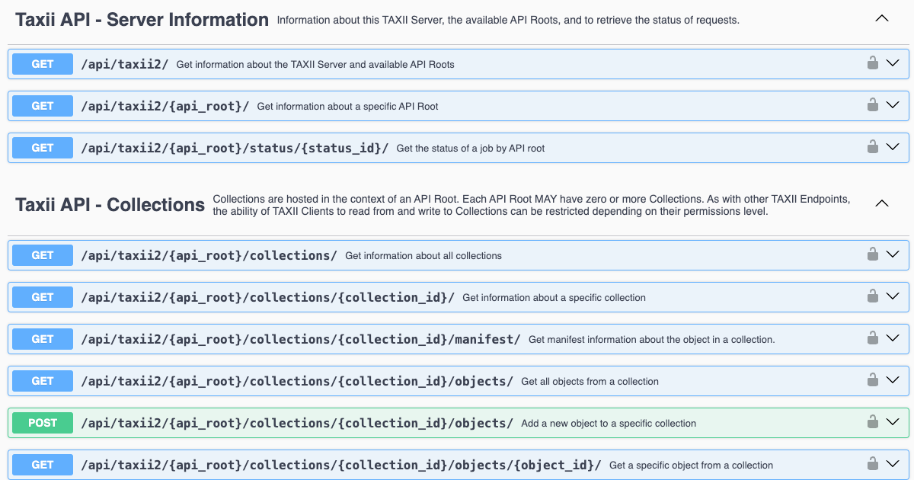

# Arango TAXII Server

[](https://codecov.io/gh/muchdogesec/arango_taxii_server)

## Overview



Arango TAXII Server is a production ready implementation of a TAXII 2.1 Server designed to work with ArangoDB.

## tl;dr

[](https://www.youtube.com/watch?v=tYWOy-S457s)

[Watch the demo](https://www.youtube.com/watch?v=tYWOy-S457s).

## Install

### Download and configure

```shell
# clone the latest code
git clone https://github.com/muchdogesec/arango_taxii_server
cd arango_taxii_server
```

### Configuration options

Arango TAXII Server has various settings that are defined in an `.env` file.

To create a template for the file:

```shell
cp .env.example .env
```

To see more information about how to set the variables, and what they do, read the `.env.markdown` file.

### Build the Docker Image

```shell
sudo docker compose build
```

### Start the server

```shell
sudo docker compose up
```

### Access the server

The webserver (Django) should now be running on: http://127.0.0.1:8009/

You can access the Swagger UI for the API in a browser at: http://127.0.0.1:8009/api/schema/swagger-ui/

## Useful supporting tools

* [TAXII 2.1 Specification](https://docs.oasis-open.org/cti/taxii/v2.1/taxii-v2.1.html)
* [STIX 2.1 Specification](https://docs.oasis-open.org/cti/stix/v2.1/stix-v2.1.html)

## Other TAXII server implementations

We realise not everyone will want to use ArangoDB. Here are some other open-source TAXII server options you could consider;

* [OASIS TC Open Repository: TAXII 2 Server Library Written in Python](https://github.com/oasis-open/cti-taxii-server)
* [A cyber threat intelligence server based on TAXII 2 and written in Golang](https://github.com/freetaxii/server)
* [TAXII server implementation in Python from EclecticIQ](https://github.com/eclecticiq/OpenTAXII)

## Support

If you are a paying DOGESEC customer, please contact our support team.

For everyone else, [minimal support provided via the DOGESEC community](https://community.dogesec.com/).

## License

[Apache 2.0](/LICENSE).