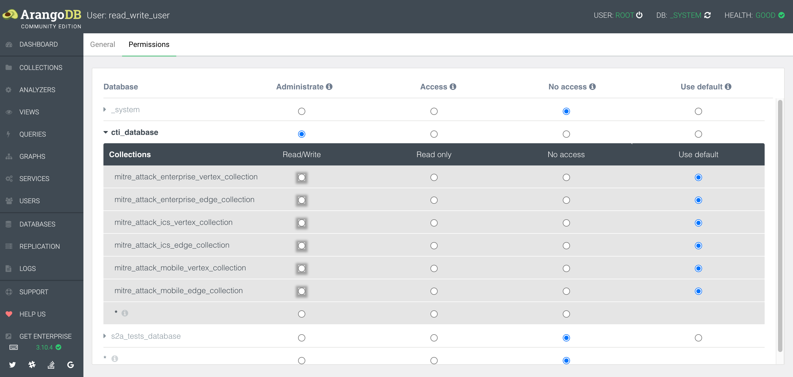

## Setup a test Arango Instance

### Create test environment outside of Docker

```shell
python3 -m venv arango_taxii_server-venv
source arango_taxii_server-venv/bin/activate
# install requirements
pip3 install -r requirements.txt
```

### Import required data

Download and setup a stix2arango install outside of arango_taxii_server (do not use the one that ships with this codebase).

Once done can then run...

```shell
python3 utilities/arango_taxii_server_import_test_data.py
```

This will install the entire MITRE ATT&CK archive into ArangoDB into a database called `arango_taxii_server_tests` with each dataset in the following collections:

* `mitre_attack_enterprise_vertex_collection`/`mitre_attack_enterprise_edge_collection`
* `mitre_attack_ics_vertex_collection`/`mitre_attack_ics_edge_collection`
* `mitre_attack_mobile_vertex_collection`/`mitre_attack_mobile_edge_collection`

### Configure Arango users for testing

To test permissions, setup 3 users in your local Arango instance by 

```shell
python3 tests/create_required_users.py
```

Which adds 4 users with the following usernames (all with password `testing123`)

* `read_write_user` (permissions, read/write to all `mitre_attack_*_vertex_collection`/`mitre_attack_*_edge_collection`)
* `read_user` (permissions, read to all `mitre_attack_*_vertex_collection`/`mitre_attack_*_edge_collection`)
* `no_access_user` (permissions, no access all `mitre_attack_*_vertex_collection`/`mitre_attack_*_edge_collection`)
* `bad_permission_user` (permissions, read/write access to `mitre_attack_enterprise_vertex_collection` and no access to all other `mitre_attack_*_vertex_collection`/`mitre_attack_*_edge_collection`)

**IMPORTANT**: You should check permissions are correctly assigned the UI before continuing. The script is not paticularly robust and I have had a number of reports of 500s being thrown on different ArangoDB installs.

To make it a bit clearer, here's an example of what `read_write_user` permissions should look like:



### Set `.env` file for arango_taxii_server

```
# ARANGO
ARANGODB='http://host.docker.internal:8529/'
# CELERY
CELERY_BROKER_CONNECTION_RETRY_ON_STARTUP=1
# POSTGRES
POSTGRES_DB=postgres
POSTGRES_USER=postgres
POSTGRES_PASSWORD=postgres
# TAXII SERVER
SERVER_BASE_URL='http://127.0.0.1:8000/'
SERVER_TITLE='Arango TAXII Server'
SERVER_DESCRIPTION='https://github.com/muchdogesec/arango_taxii_server/'
SERVER_MAX_CONTENT_LENGTH=10485760
SERVER_EMAIL='noreply@dogesec.com'
SERVER_SUPPORT='https://community.dogesec.com/'
```

## Test descriptions

* test_0: ensures that when no credentials are provided 401s are returned
* test_1: tests the `no_access_user` who should not be able to access most of the endpoints as they have no read access to any of the collections

## Running tests

Run 

```shell
pytest
```

from the root directory of this code.
